# 🏆 TradePro - Decentralized Investment Vaults Platform

<div align="center">


[](https://nextjs.org/)
[](https://soliditylang.org/)
[](https://getfoundry.sh/)
[](https://www.typescriptlang.org/)
[](https://wagmi.sh/)

**A revolutionary decentralized platform where professional traders manage investment vaults through smart contracts, enabling users to earn passive income from expert trading strategies.**

[🚀 Live Demo](#) • [📚 Documentation](#features) • [🔧 Installation](#installation) • [💼 Contributing](#contributing)

</div>

---

## 🌟 Platform Overview

TradePro is a **decentralized autonomous investment platform** that bridges professional traders with passive investors through blockchain-powered vaults. Each vault is managed by verified professional traders who execute sophisticated investment strategies while users earn proportional returns based on their deposits.

### 🎯 Core Concept


## 🏗️ System Architecture

### 🔐 Smart Contract Layer

The platform is built on a robust smart contract infrastructure that ensures **transparency**, **security**, and **automated execution** of all operations.


### 📱 Frontend Architecture

```mermaid
graph TB
    A[Next.js Frontend] -->|Web3 Integration| B[Wagmi Hooks]
    B -->|Blockchain Connection| C[Smart Contracts]
    A -->|UI Components| D[Product Cards]
    A -->|State Management| E[React Context]
    D -->|User Actions| F[Vault Operations]
    
    subgraph "🎨 User Interface"
        G[Vault Dashboard]
        H[Trading Analytics]
        I[Portfolio Tracker]
    end
    
    A --> G
    A --> H
    A --> I
    
    style A fill:#000,color:#fff
    style B fill:#646cff,color:#fff
    style C fill:#f7931e,color:#fff
```



---
🧪 BSC Testnet Setup & Free tBNB
<center>


</center>

🚀 Adding BSC Testnet to MetaMask

-----------------------------------------------------------------------------------------

To interact with the contracts deployed on BSC Testnet, you need to add the network to MetaMask.

🔧 Network Configuration

Open MetaMask → Settings → Networks → Add network and enter:

Network Name: BSC Testnet

RPC URL: https://data-seed-prebsc-1-s1.binance.org:8545

Chain ID: 97

Currency Symbol: tBNB

Block Explorer URL: https://testnet.bscscan.com

Save the network and switch to BSC Testnet.

💰 Getting Test tBNB

You will need test tokens to pay gas fees.

Get free tBNB from the official faucet:
👉 https://testnet.bnbchain.org/faucet-smart

How to request:

🔹 Steps to Request tBNB

Open the official BNB Chain faucet:
👉 https://testnet.bnbchain.org/faucet-smart

Connect your wallet (MetaMask) or paste your BSC Testnet wallet address

Select BSC Testnet

Request tBNB

After a short delay, test BNB will be sent to your wallet.

✅ Notes

Test BNB has no real value

Faucet requests may be rate-limited

Make sure MetaMask is switched to BSC Testnet

## ⚡ Key Features

### 🏦 **Professional Vault Management**
- **Verified Traders**: Each vault is managed by professionally verified traders with proven track records
- **Transparent Performance**: Real-time APY tracking and historical performance data
- **Strategy Diversity**: Multiple trading approaches from conservative to high-yield strategies

### 💰 **Flexible Investment Options**
- **Low Entry Barriers**: Start investing with as little as 0.01 ETH
- **Monthly Subscriptions**: Affordable monthly fees (10-20 USD) for vault access
- **Instant Liquidity**: Withdraw your funds at any time without lock-up periods


### 🗳️ **Community Governance**
- **Trader Rating System**: Like/dislike voting mechanism for trader performance
- **Transparent Metrics**: Real-time vault statistics and performance indicators
- **Community Feedback**: User reviews and trader accountability

---

## 🚀 How It Works


### 1️⃣ **Vault Selection & Joining**

```mermaid
sequenceDiagram
    participant U as 👤 User
    participant F as 🖥️ Frontend
    participant C as 📝 Smart Contract
    participant V as 🏦 Vault
    
    U->>F: Browse available vaults
    F->>U: Display vault options & APY
    U->>F: Select vault & enter deposit amount
    F->>C: Call joinVault() function
    C->>V: Add user to vault members
    V->>C: Update user deposit balance
    C->>U: Confirm successful join
```



### 2️⃣ **Trading Operations & Revenue Generation**

```mermaid
sequenceDiagram
    participant T as 👨‍💼 Trader
    participant V as 🏦 Vault Contract
    participant D as 🌐 DeFi Protocols
    participant R as 💰 Revenue Pool
    
    T->>V: Execute trading strategy
    V->>D: Interact with DEXs, lending protocols
    D->>V: Generate returns/yields
    V->>R: Accumulate profits
    R->>V: Calculate user shares
    V->>T: Distribute performance fee
```



### 3️⃣ **Withdrawal Process**

```mermaid
sequenceDiagram
    participant U as 👤 User
    participant C as 📝 Contract
    participant V as 🏦 Vault
    
    U->>C: Request withdrawal (amount)
    C->>V: Validate user balance
    V->>C: Calculate total returns
    C->>U: Transfer principal + profits
    V->>V: Update vault metrics
```



---

## 💼 Available Vaults

### 🔷 **Mike's Conservative Vault**
- **Strategy**: Low-risk, steady returns
- **APY Target**: 50%
- **Monthly Fee**: $10 USD
- **Focus**: Stablecoin farming, blue-chip DeFi protocols

### 🟣 **James's Balanced Vault**  
- **Strategy**: Medium-risk, balanced portfolio
- **APY Target**: 70%
- **Monthly Fee**: $15 USD
- **Focus**: Mix of lending, DEX trading, yield farming

### ⚫ **John's Aggressive Vault**
- **Strategy**: High-risk, maximum returns
- **APY Target**: 120% 
- **Monthly Fee**: $20 USD
- **Focus**: Leveraged positions, new DeFi protocols, arbitrage

---

## 🛠️ Technical Stack

### **Blockchain & Smart Contracts**
- **Solidity 0.8.19**: Smart contract development
- **Foundry**: Testing and deployment framework
- **OpenZeppelin**: Security standards and utilities

### **Frontend Development**
- **Next.js 14**: React-based web framework
- **TypeScript**: Type-safe development
- **Tailwind CSS**: Utility-first styling
- **Wagmi**: Web3 React hooks

### **Web3 Integration**
- **Viem**: TypeScript Ethereum library
- **ConnectKit**: Wallet connection interface


## 📈 Smart Contract Functions

### **Core Vault Operations**
```solidity
// Join a vault with ETH deposit
function joinVault(uint256 vaultId) external payable

// Add additional deposit to existing position
function addDeposit(uint256 vaultId) external payable

// Withdraw funds with accumulated returns
function withdrawEth(uint256 vaultId, uint256 amount) external

// Get user's deposit in a specific vault
function getUserVaultDeposits(uint256 vaultId, address user) external view returns (uint256)

// Vote for trader performance
function voteTrader(uint256 vaultId, bool isPositive) external
```

### **Administrative Functions**
```solidity
// Create new vault (admin only)
function createVault(string memory name, address trader, uint256 fee) external onlyOwner

// Emergency pause functionality
function pause() external onlyOwner
function unpause() external onlyOwner

// Update vault parameters
function updateVaultFee(uint256 vaultId, uint256 newFee) external onlyOwner
```

---

## 🎮 User Interface

### **Main Dashboard**
The platform features an intuitive dashboard displaying:

- 📊 **Real-time vault performance metrics**
- 💰 **User portfolio overview**  
- 📈 **Historical APY trends**
- 🏆 **Trader leaderboards**

### **Vault Cards**
Each vault is presented with:
- Trader profile and verification status
- Current APY and performance history
- Monthly subscription fee
- Community ratings (thumbs up/down)
- Join/deposit/withdraw actions

### **Interactive Features**
- 🌓 **Dark/Light mode toggle**
- 📱 **Mobile-responsive design**
- ⚡ **Real-time balance updates**
- 🔔 **Transaction notifications**

---

## 🔒 Security Features

### **Smart Contract Security**
- ✅ **Access Control**: Role-based permissions
- ✅ **Reentrancy Protection**: Secure external calls
- ✅ **Emergency Pause**: Circuit breaker mechanism
- ✅ **Input Validation**: Comprehensive parameter checking

### **Audit & Testing**
- 🧪 **Comprehensive Test Suite**: 95%+ code coverage
- 🔍 **Static Analysis**: Slither integration
- 📋 **Manual Review**: Professional security audit
- 🏗️ **Formal Verification**: Mathematical proofs

---


## 🤝 Contributing

We welcome contributions from the community! Here's how you can help:

### **Development Workflow**
1. 🍴 **Fork the repository**
2. 🌿 **Create a feature branch** (`git checkout -b feature/amazing-feature`)
3. 💾 **Commit your changes** (`git commit -m 'Add amazing feature'`)
4. 📤 **Push to branch** (`git push origin feature/amazing-feature`)  
5. 🔄 **Open a Pull Request**

### **Areas for Contribution**
- 🐛 **Bug fixes and improvements**
- ✨ **New vault strategies**
- 🎨 **UI/UX enhancements** 
- 📚 **Documentation updates**
- 🧪 **Additional test coverage**

---


## 📜 License

This project is licensed under the **MIT License** - see the [LICENSE](LICENSE) file for details.

---

## 🆘 Support & Community

### **Get Help**
- 📧 **Email**: tradepro.web3@gmail.com
- 🐦 **X**: [@TradePro](https://x.com/TradeProWeb3)
- 📖 **Pitch Deck**: [Full presentation](https://docs.google.com/presentation/d/1Iw2cUxO_S5Vv2UQPCAiTglm8uVvyb059X0x86JlfMX4/edit?usp=sharing)
- 


## ⚠️ Disclaimer

**Investment Risk Warning**: Trading and DeFi investments carry inherent risks. Past performance does not guarantee future results. Only invest what you can afford to lose. TradePro is experimental software - use at your own risk.

---

<div align="center">

**Built with ❤️ by the TradePro Team**

[🌟 Star this repo](https://github.com/your-username/tradepro1) • [🔗 Share with friends](https://twitter.com/intent/tweet?text=Check%20out%20TradePro%20-%20Decentralized%20Investment%20Vaults!) • [📧 Stay updated](https://tradepro.io/newsletter)

</div>
